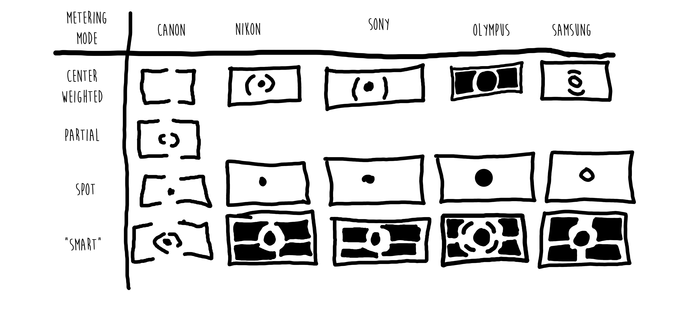
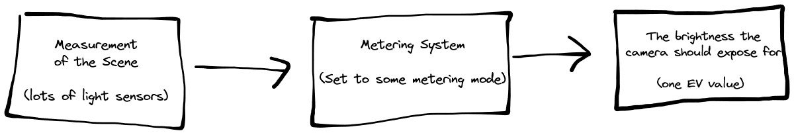

## Metering Modes Overview
The goal of the metering mode is to take the measurement of the brightness of the scene and determine the desired exposure.

The metering mode does not determine which settings to adjust to get to the exposure, just what the exposure should be overall, considering how bright it is. The meter will still work when the camera is in manual mode. (In manual mode, the camera may still report its measurement, you're free to ignore it).

The goal of the metering mode is to take all the light data we have and convert it into a single number. It turns out to be a fairly complex problem, and a good exposure takes more insight than pointing a [selenium meter](https://en.wikipedia.org/wiki/Selenium_meter) forwards.

Consider mirrorless cameras. They usually measure light with the image sensor directly.  

This means that, as a light meter, the image sensor has a reading for every single pixel of the image. We have to turn that into a proper [exposure value](https://en.wikipedia.org/wiki/Exposure_value).

The metering mode is the algorithm for doing just that. There are only a few different kinds of metering modes, and all cameras use the same setup. That's a good thing, actually.

### Average
Average all the 'pixels' together. Expose such that this value is middle-grey. Middle grey is as far from overexposed or underexposed as possible.

Turns out, basically doesn't work very well, and nobody uses average.

### Center-Weighted
Average the pixels together and try to get to middle-grey again, but this time bias the average heavily towards the pixels in the middle of the screen, and ignore the pixels on the edge.

Turns out, pretty good! You could basically point-and-shoot. But it's also predictable. Photographers can learn center-weighted meterings quirks, predict it's output, and adjust with exposure compensation before ever taking the photo. 
Because of that, every camera **must** have center-weighted metering. Because for some photographers, it's all they need - they can shoot great with any camera with this mode.

### Spot
Only look at a very small area of the scene. Usually less than 5% of the entire image area. The spot is usually the center, but can be moved on some cameras. The trick is that the user can point this wherever they want. For example, they could point this at something they know the desired brightness of, like a [grey card](https://en.wikipedia.org/wiki/Gray_card), or skin tones. 

Or, instead of just pointing it at one thing, the user could spot meter a variety of different areas of the image, and do manipulation to get the perfect exposure. This is basically how [Ansel Adam's Zone System](https://en.wikipedia.org/wiki/Zone_System) works. 

### Partial
Canon's cheap-out on trying to sell a spot metering that isn't small enough to actually be spot metering.

### Matrix / Evaluative / Multi / Smart
Auto-mode pioneered by Nikon. It's not magic. When Nikon first released "AMP", it released some [documentation](https://www.kenrockwell.com/nikon/matrix01.htm) on how the system works.

It works, it works well, but it can be inconsistent. Moving the camera a small amount might jump cause the camera to switch to a different internal reference, and the exposure might change. A small change in input may lead to a large change in output. (A [discontinuous function](https://en.wikipedia.org/wiki/Continuous_function)?) This is terrible when trying to batch-edit images, and mildly annoying otherwise.

But when it comes to a single image, Matrix mode is pretty great. It's not magic, but it can feel *like* magic when it just works.

I like to switch my camera to matrix as a default, so if I ever have to grab my camera in a hurry, it's not in Spot Metering, at least, and it's not in Manual Mode, and I can hopefully just pick the camera up and shoot and get a usable image.

# Worklow Notes

Matrix mode is great for when you're running around, but can get in the way when doing studio lighting or shooting when the scene doesn't change much (like different headshots, or when on a tripod). 

Spot metering is excellent, but not on a tripod, since you generally have to point by moving the camera around then pressing the [*] or [Ev] button, or half-press the shutter. I find it best to configure the camera so the half-press of the shutter only do one thing (auto-focus or meter), and not both (as is often the default). 

If you switch between cameras frequently, or are borrowing a friends strange camera and need to get usable shots, then center-weighted will be your friend. You can trust it will behave as expected.

There is no best metering mode. There's a reason cameras are designed to let you switch between modes at the press of a button. Don't set it and forget it, don't debate which one is best, just choose the right tool for the job.
