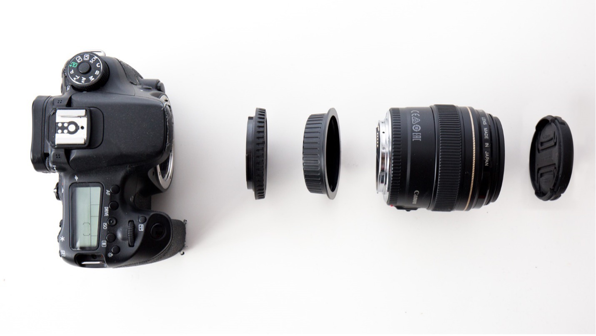

# Lens Caps

Lens caps! Remember to take it off the lens before you go to take a photo. You’re welcome for this professional insight.

You can leave now! There isn't much to say about lens caps. Why is this page so long?

An assortment of lens caps

Lens caps have two jobs. The first, protect the lens from scratches, of course. The second is that they protect the lens from *lighting itself on fire.* Well, almost. If your camera is pointed at the sun, you may accidentally burn a hole into the image sensor or shutter. Lens caps stop that kid-with-magnifying-destroying-an-ant moment from happening.

> ☀️ Regardless of the lens cap, don’t get into the habit of leaving your camera pointed at the sun.

Lens caps are easily lost and easily replaced. I recommend always putting them in the same place in your bag (IE: the front-most pocket, or in the same padded area that you took your lens from), or in the same place on your person (ie: my front left shirt pocket, or from left pants pocket if my shirt has no pocket). Then you always check the same place first, and you don’t do a silly hambones dance looking for it. One less thing to think about.

With the exception of fisheye lenses with easily scratched outward-bulging glass, you can pretty safely leave your lens cap in your bag while you are out and about shooting. Constantly taking the lens cap on and off is going to get in your way more than it’s going to protect your lens.

> 💡 When the camera is in your hands, **you** are its main source of protection, not the lens cap.

# The Camera Body Cap and the Lens Body Cap

Camera body and lens body caps go hand-in-hand.

The lens cap isn’t the only important little piece of cheap plastic in your bag.

The camera body cap goes on your camera body when it has no lens, and the same for the lens body cap, but for when the lens is not attached to a camera.
 
> The lens body cap is also called the “rear lens cap”

If you only have one lens and it lives on your camera, you maybe don’t even know where these caps are. **Oh no! You should try to find them.**

For one, if you ever want to sell your gear, you may want to sell it piecewise – with caps. Second, they are important for storage and safe travel. A camera body without a lens is a much sturdier brick of a thing, more easily packed away securely in a bag, and takes up less space. Likewise for lenses.

If you have more than one lens, then you are more certainly aware of the need for the little caps. The back of the lens is far more fragile and sensitive than the front, containing less protective coatings on the glass, and the lens can misbehave if the electrical contacts get dirty.

Conveniently, the camera body cap and the lens body cap will snap together.

> 💬 In a pinch, I will use this as spare SD card storage, and it stops the caps from making noise, rattling in my bag.

Left to Right: Camera Body, Camera Body Cap, Lens Body Cap, Lens, Lens Cap
