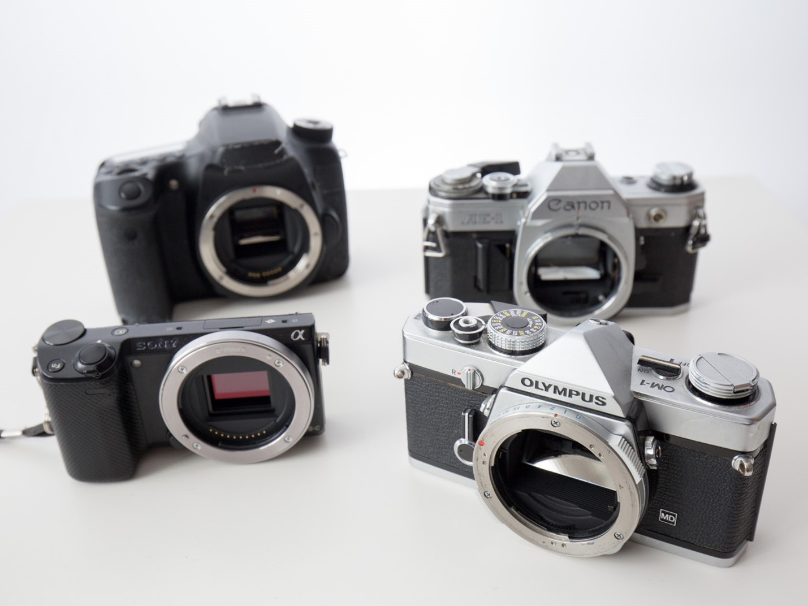

# Lens Mount

Cameras with removable lenses are called ‘camera systems’, which use ‘interchangeable lenses.’ But we will just say ‘cameras’ and ‘lenses’ for simplicity.

## Changing Lenses
The lens locks into place. There's a button [usually] on the front of the camera body that unlocks the lens. You can then twist until it easily comes free. You never need to use significant force, or tighten the lens. It simply clicks into place, or out. This type of attachment is called a "bayonet" mount.

To put the lens on a camera, line up the mount (there's are markings, usually a little dot or square, on both the camera and the lens), and align them until the lens sits **completely flush** with the camera. Twist until it clicks into place. Double check it's actually locked in if you aren't confident.

Compared to other types of mounts, bayonet mounts risk damaging parts of the camera less, and they ensure electrical contacts (Like for the auto focus motor) are properly aligned.

Other mounting systems, like simple screw-on (of various diameters), used to be widely used. Nowadays it's bayonet or bust.

> 💬 Bayonet mount in a single sentence: Align, insert perfectly flush, turn until it locks into place with a click.

Different camera manufacturers have their own lens mounts, so we can’t mix-and-match lenses between mounts. Some manufacturers have more than one kind of lens mount, as they have different *sizes* of lens/image sensor.

Clockwise from the top left: Canon 70D, Canon AE-1, Olympus OM-1, Sony NEX-5t. Note how the bottom left camera does not have a mirror inside of it, nor a little bump on top, and it has no viewfinder. This is a "mirrorless" camera. The other 3 are SLR’s.

## Mount Adapters

While you can’t mix and match lenses, you can purchase adapters. Lens adapters allow you to use a lens with one mount onto a camera body with a different mount type. It’s rare but not unheard of for manufacturers to make cameras with a shared standard (such as “micro four thirds”)

> 💬 You have to be careful to check if you have a Canon camera. They have multiple mounts that are cross compatible, there is the Canon EOS mount (white square alignment marker) and the Canon EF mount (red dot alignment marker). They are physically and electronically inter-compatible, but not optically: you’ll either be cropping in (bigger lens on smaller image sensor) or you will have bad vignetting (smaller lens on bigger image sensor).
> 
> I suppose it’s also possible you found a Canon FD mount lens. I bet you got a great deal on it. If it is an FD mount, what are you doing? Where did you get that? They stopped making cameras with FD mounts in the early 90s. Buy an adapter on the cheap and have some fun with it, but don’t expect optical perfection.

## Further Reading

- [Bayonet Mount at Wikipedia](https://en.wikipedia.org/wiki/Bayonet_mount)
