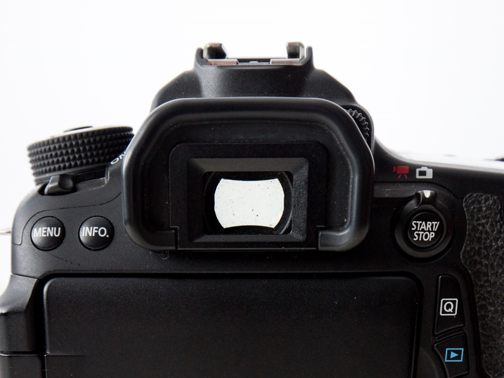
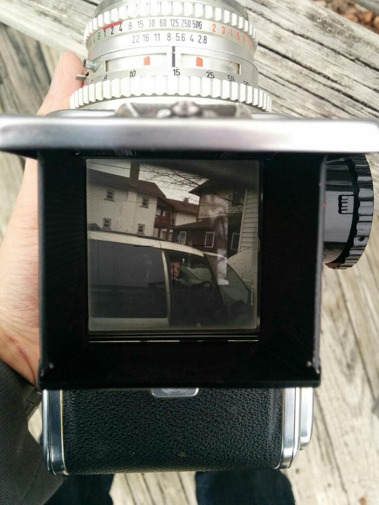

# The Viewfinder

The main way we categorize cameras is by their style of viewfinder. Why is that? It matters more than almost any technical specification. The type of viewfinder has the largest impact on your photo-taking workflow.

This makes sense. The viewfinder determines how you hold the camera. Is it at your waist looking down through the top, or held up to you eye? Is it a few inches away from your face, or through an external device?

> 💬 Well, in my personal opinion, the presence of a tripods is probably the most impactful single thing on your workflow, but that’s more of an accessory than part of the camera.
>

*Viewfinder of Canon 70D. In need of cleaning.*

> 💬 *Please don't judge me for how dusty this camera is. It's been through a lot and has spent the past decade just sitting on a shelf.*
> 
> 
You look through this viewfinder, the light is reflected through some optics and mirrors, and out the lens. Nifty! The rubber bit around the viewfinder is to make the camera more comfortable when you press it against your face.

The Viewfinder is an important part of the camera. We will be circling back on it later, digging more deeply into the differences between types of cameras, and how to adjust them for clarity, even if you wear glasses.

Some cameras don’t really *have* viewfinders. They, hopefully, at least have screens on the back (we call these “compact” or “point ‘n shoot” cameras. Or, perhaps they connect wirelessly to another screen, like how a GoPro or drone can connect to your phone. Your phone, then, is the viewfinder.

The Hasselblad 500C viewfinder is a waist-level viewfinder. The viewfinder is at the top of the camera, and you look down into it.

Nowadays, digital cameras can accomplish this with what we professionals call a "flippy spinny screen".
