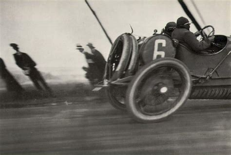

Different shutter speeds affect how objects in motion appear in our image. But we can affect more than just freezing or bluring moving things.

Photography isn't instantaneous. Other properties can change while the shutter is open. This is usually unwanted, but we can leverage the resulting effects for our creative objectives.

## Camera Motion
